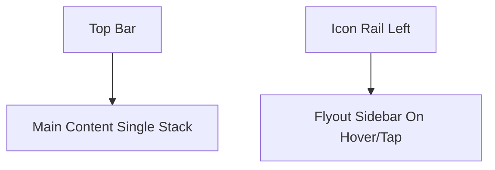
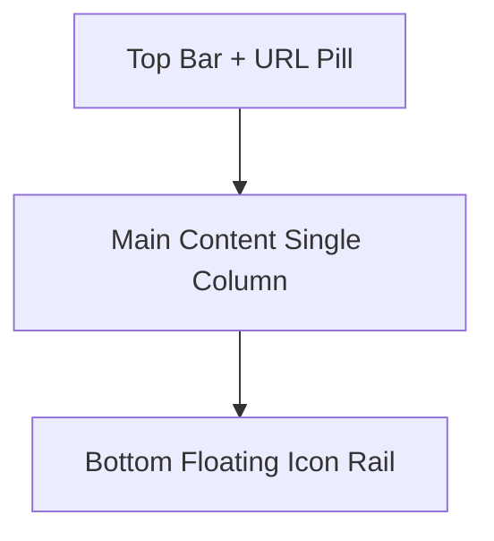

# Aura Bot Dashboard Replica - Design Specification

## 1) Visual Decomposition From Reference

### Navigation structure
- Browser-like top bar with traffic lights + centered URL pill.
- Left icon rail (compact, vertical, rounded icons).
- Expanded left navigation (grouped headings + list links + active row).
- Main content area with title and card grid.

### Content hierarchy
- Hero section: "Server Health Summary".
- Row 1: overview analytics card + earnings chart card.
- Row 2: form-heavy "Button Roles Builder" + compact "Button Builder" panel.
- Row 3: "Verification/Greetings Builder" + "Illustration" chat card.

### UI components extracted
- Glassmorphism panels with neon cyan/pink edge glows.
- Stats counters, mini line/area chart blocks.
- Inputs, selects, chips, tags, and action-like role pills.
- Card footer reactions (upvote/downvote style).

## 2) Color Palette (Hex)

### Core backgrounds
- `#0B0F2A` deep navy base.
- `#1B1B4D` indigo layer.
- `#4F2A82` violet ambient gradient.
- `#10142BC7` shell glass tone.
- `#28234388` primary panel glass.
- `#30235E96` secondary panel glass.

### Text
- `#F2F4FF` primary text.
- `#D2D7F8` secondary text.
- `#A8AFDC` tertiary/muted text.

### Neon accents
- `#45E6F2` cyan glow.
- `#6FFFE6` mint glow.
- `#B18EFF` violet glow.
- `#EE8DFF` pink glow.

### Semantic controls
- `#7E6FF5` purple chip.
- `#32C86D` green chip.
- `#EF5252` red chip.
- `#8E94AD` gray chip.

## 3) Typography

### Font families
- Headings: `Sora, sans-serif`
- Body/UI: `Manrope, sans-serif`

### Type scale (desktop -> mobile)
- Page title: `54px` (clamp down to `26px`).
- Card title: `42px` (clamp down to `22px`).
- Big stat numbers: `52px` (clamp down to `22px`).
- Section titles in sidebar: max `39px`, responsive clamp.
- Body/nav/input labels: `16px` to `20px`.

### Weights
- 800: key headings and major numbers.
- 700: card titles and nav group labels.
- 600: labels and normal UI text.
- 400/500: supportive descriptions.

## 4) Spacing + Radius System

### Spacing tokens
- `6, 10, 14, 18, 24, 32` px.

### Radius
- Shell corners: `26px`.
- Large cards: `24px`.
- Medium controls: `14px`.
- Small chips/fields: `10px` to `12px`.

### Layout gutters
- Desktop content padding: `24px`.
- Tablet content padding: `18px`.
- Mobile content padding: `14px`.

## 5) Responsive Breakpoints

- `<= 1600px`: slight width compaction.
- `<= 1280px`: convert card rows to single-column stacks.
- `<= 992px` (tablet): side nav becomes hover/flyout panel; icon rail remains.
- `<= 768px` (mobile): bottom floating icon rail; single-column all blocks.
- `<= 560px`: tighter radius/padding and control sizes.

## 6) Wireframes / Mockups

### Desktop wireframe (>=1281px)
```mermaid
flowchart LR
  A[Top Bar] --> B[Icon Rail]
  A --> C[Expanded Sidebar]
  A --> D[Main Content]
  D --> E[Row 1: Overview | Earnings]
  D --> F[Row 2: Roles Builder | Button Builder]
  D --> G[Row 3: Greetings | Illustration]
```

### Tablet wireframe (769px-992px)


### Mobile wireframe (<=768px)


## 7) Accessibility & Standards

- Semantic structure: `header`, `aside`, `nav`, `section`, `article`, `footer`.
- Controls include labels and clear active states.
- Focusable items have visible hover/focus styling.
- Text color choices maintain high contrast against dark backgrounds.
- Responsive behavior avoids horizontal overflow and preserves touch targets.
- Inputs/selects use readable font sizes on mobile (`>=16px`).

## 8) Delivered Implementation Files

- HTML replica: `website/public/aura-ui-replica.html`
- CSS system: `website/public/assets/aura-ui-replica.css`

